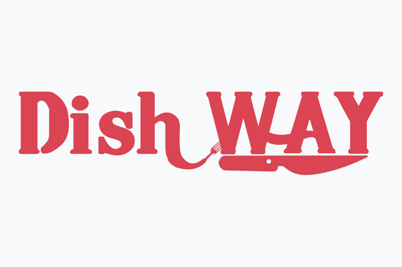

# 
# DishWay

A mobile app for finding new restaurants and simplifying bookings.

## Getting Started

To get the PhoneGap server running locally:

- Clone this repo
- `phonegap run` to install all required dependencies
- Install MongoDB Community Edition ([instructions](https://docs.mongodb.com/manual/installation/#tutorials)) and run it by executing `mongod`
- `phonegap serve` to start the local server

## Dependencies

- [expressjs](https://github.com/expressjs/express) - The server for handling and routing HTTP requests
- [express-jwt](https://github.com/auth0/express-jwt) - Middleware for validating JWTs for authentication
- [jsonwebtoken](https://github.com/auth0/node-jsonwebtoken) - For generating JWTs used by authentication
- [mongoose](https://github.com/Automattic/mongoose) - For modeling and mapping MongoDB data to javascript 
- [mongoose-unique-validator](https://github.com/blakehaswell/mongoose-unique-validator) - For handling unique validation errors in Mongoose. Mongoose only handles validation at the document level, so a unique index across a collection will throw an exception at the driver level. The `mongoose-unique-validator` plugin helps us by formatting the error like a normal mongoose `ValidationError`.
- [passport](https://github.com/jaredhanson/passport) - For handling user authentication
- [slug](https://github.com/dodo/node-slug) - For encoding titles into a URL-friendly format

## Application Structure

- `app.js` - The entry point to our application. This file defines our express server and connects it to MongoDB using mongoose. It also requires the routes and models we'll be using in the application.
- `config/` - This folder contains configuration for passport as well as a central location for configuration/environment variables.
- `routes/` - This folder contains the route definitions for our API.
- `models/` - This folder contains the schema definitions for our Mongoose models.

## Authors

* **Cláudio Rodrigues** - *Full Stack* - [My profile](https://github.com/claudiorodr)

## License

This project is licensed under the MIT License - see the [LICENSE.md](LICENSE.md) file for details
# 

